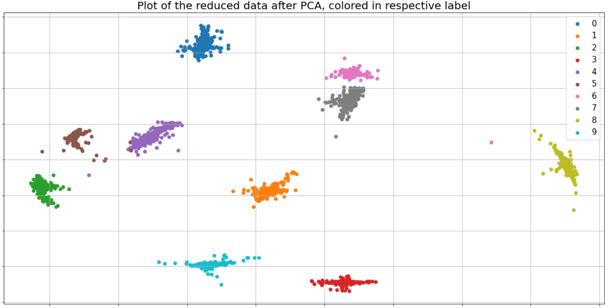
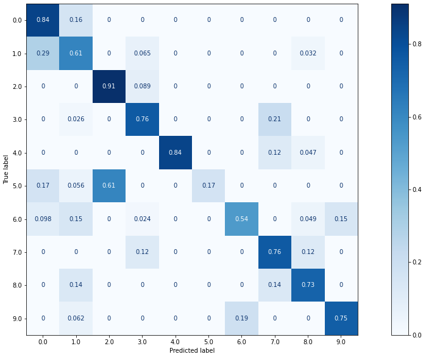
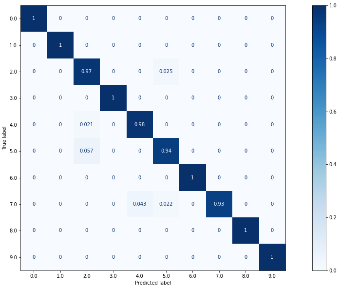

# Using Triplet Loss Neural Networks for Feature Reduction and Model Perfomance increase in a Machine Learning Pipeline

<h2 align="center">
    
</h2>

  

-------

## Content

- [`About the Project`](#about-the-project)
- [`What is Triplet Loss?`](#what-is-triplet-loss-?)
- [`Results`](#results)
- [`Next Steps`](#next-steps)

  

-------

## About the Project
This repositoriy is built to play around with some well-known datasets - such as [`MNIST dataset`](http://yann.lecun.com/exdb/mnist/) or [`UNB's NSL-KDD dataset`](https://www.unb.ca/cic/datasets/nsl.html) - to demonstrate a typical `Machine Learning Pipeline`, the power of `Feature Reduction`, using `Neural Networks` with [`Triplet Loss`](https://towardsdatascience.com/image-similarity-using-triplet-loss-3744c0f67973). 

  

-------

## What is Triplet Loss?
`Triplet Loss` can be easily implemented into a 'normal' `Neural Network`, the only difference is made during the training procedure by using a different loss than well-known [`Categorical Cross Entropy Loss`](https://gombru.github.io/2018/05/23/cross_entropy_loss/), [`Hinge Loss`](https://medium.com/analytics-vidhya/understanding-loss-functions-hinge-loss-a0ff112b40a1) or others that are used for classification purposes. In contrast to those `loss functions`, `Triplet Loss` is not directly used for classification. Similar to [`(Fisher's) Linear Discriminant Analysis`](https://sebastianraschka.com/Articles/2014_python_lda.html), `Neural Networks` using `Triplet Loss` are transforming the given data - can be anything from images (Computer Vision) up to any other classification dataset - to find a representation maximizing both, the `in-class-similarity` and the `out-of-class` difference of all samples.

  

-------

## Results

After transforming the given raw dataset, the resulting representation can be used to fit a [`Principal Component Analysis (PCA)`](shorturl.at/lyNZ0). The following graphics meanwhile show the immense power of `Neural Networks with Triplet Loss` in increasing the models performance while decreasing the feature space.

-------

### MNIST
Here, samples from the `MNIST` are transformed from their original shape (of `28x28` pixels) down to only `2` dimensions - that the result can be shown graphically:

<h2 align="center">
    
</h2>

Using a `PCA` to transform the data down to `2` dimensions

<h2 align="center">
    
</h2>

Using a `Neural Network with Triplet Loss` and a `PCA` to transform the data down to `2` dimensions

  

<h2 align="center">
    
</h2>

Confusion Matrix after  a `PCA` transformed the data down to `2` dimensions

<h2 align="center">
    
</h2>

Confusion Matrix after `Neural Network with Triplet Loss` and `PCA` to transformed the data down to `2` dimensions

-------

Given the result of the first transformation, it seems very hard for a (very simple) classifier - such as `Support Vector Machine (SVM)`, `K-Nearest Neighbors (KNN)`, etc. - to achieve high accuracies. In contrast to that, having the results of the second transformation, it is very likely for such a simple classifier to achieve very high and stable accuracies.

This can also be seen in the two different confusion matrixes, pointing out that the used `SVM` is much more successful to predict the transformed data. All evaluated metrics, namely `accuracy`, `precision`, `recall` and `f1 score` - described [`here`](https://towardsdatascience.com/accuracy-precision-recall-or-f1-331fb37c5cb9) - are widely higher for the second transformation!

The exact results after training (using the whole training dataset) during prediction on the test dataset!:

**Graphics and shown results were achieved using a Notebook on [`Google Colab`](https://colab.research.google.com/) with same input and same parameters (as in provided Jupyter Notebook) with 2000 epochs and a EarlyStopping patience of 100!**

|           | PCA    | NN with Triplet Loss + PCA |
| --------- | :----: | :------------------------: |
| Accuracy  | 47.49% | 99.98%                     |
| Precision | 0.49   | 1.00                       | 
| Recall    | 0.48   | 1.00                       |
| F1 Score  | 0.46   | 1.00                       |

-------

### NSL-KDD

Using [`UNB's NSL-KDD dataset`](https://www.unb.ca/cic/datasets/nsl.html) to evaluate the power of a `Triplet Loss` configured `Neural Network` result in an immense performance increase as well! Even though the resulting graphics after transformation are not as satisfying as the above ones (exact results can be seen in [`nsl_kdd.ipynb`](nsl_kdd.ipynb)), a trained standard `Support Vector Machine (SVM)` has massively increased performance by decreasing the input feature space from `112` down to `2`:
  

<h2 align="center">
    
</h2>

Confusion Matrix after  a `PCA` transformed the data down to `2` dimensions

<h2 align="center">
    
</h2>

Confusion Matrix after `Neural Network with Triplet Loss` and `PCA` to transformed the data down to `2` dimensions

-------

The exact results after training (using the whole training dataset) during prediction on the test dataset!:

|           | PCA    | NN with Triplet Loss + PCA |
| --------- | :----: | :------------------------: |
| Accuracy  | 68.65% | 99.27%                     |
| Precision | 0.72   | 0.99                       | 
| Recall    | 0.69   | 0.99                       |
| F1 Score  | 0.67   | 0.99                       |

  

-------

## Next Steps

- try more datasets
- restructure [`utils.py`](scripts/utils.py) to gain more clarity, especially while using all the implemented `preprocessing` steps